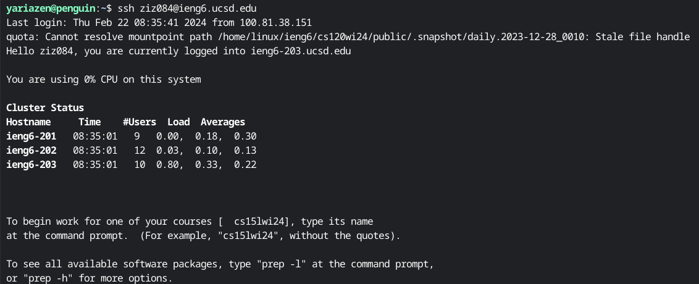
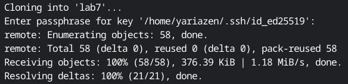
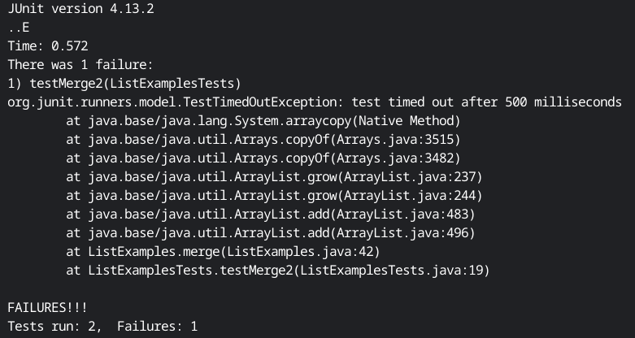
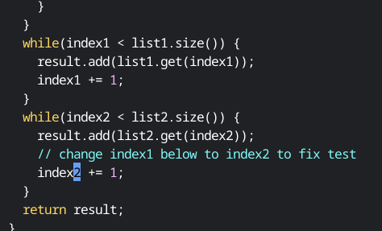
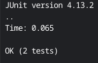
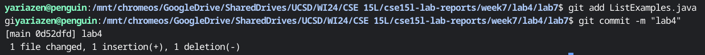

# Lab 4

## Step 4


Logging into ieng6 with my private ssh key. I'll be doing it locally from here on out. Locally means I will be doing the rest of the lab on my local machine insteaed of the ieng6 server. I do so because I have been using my personal github account, and I refuse to store my private keys which I use for more than just github on our school's servers. Not because I don't trust our school's security, but I trust myself to forget to remove them from the server and I don't want a log of my private keys hanging around.

Key pressed: ```ssh ziz084@ieng6.ucsd.edu```

This is the command to use the secure shell protocol to access a server remotely. 

## Step 5


Cloning lab7 repo

Key pressed: ```git clone git@github.com:Yariazen/lab7.git```

This is the command to clone a repository using git. This is not what I will be running.

Key pressed: ```git submodule add git@github.com:Yariazen/lab7.git```

I will be adding the repo as a submodule so that I can continue to manage all my labs in the same repository. The output of the 2 commands are identical.

```cd lab7``` to work in the ```lab7``` directory.
## Step 6


Running the tests

Key pressed: ```bash test.sh```

You can use tab autocomplete, but the specific performance depends on your system. For example, I could have a command called ```base64``` or ```base32``` which I do, which would make it not possible to autocomplete ```bash```. For ```test.sh``` I can, but its 7 characters. However, it's more inconvenient for me to type ```<tab>``` than it is for me to just type the additional 5 characters since typing tab requires me to adjust my right hand.

Finally, this is just the command to explicitely invoke the Bash shell to interpret and run the script ```test.sh``` . 

## Step 7


Key pressed:
- ```vim ListExamples.java```: This command opens ```ListExamples.java``` in the vim editor.

- ```44G```: This command goes to line 44. Realisically however, there's no real way to know where the bug is exactly, and there's no point in doing this with only keypresses. How many of us are planning on becoming mainframe developers? Probably none of us, and that's the most probable reason for someone to not be able to scroll through a document with a mouse.

- ```e```: This command moves the cursor to the end of the current word.

- ```r2```: This command tells vim to replace the current character with the next input. Following r, entering 2 would replace the current character with 2.

- ```:wq```: ```:``` enters command mode. ```w``` is write, and ```q``` is quit. So in total, this command tells vim to enter the command mode, write and then quite the current file.

## Step 8


Key pressed: ```<up><up><enter>```

If you follow the command I've entered into the terminal thus far
- ```ssh ziz084@ieng6.ucsd.edu```
- ```git clone git@github.com:Yariazen/lab7.git```
- ```bash test.sh```
- ```vim ListExamples.java```

Then entering ```<up>``` twice would put me at ```bash test.sh```. Then presseing enter would run the command.

## Step 9


Key pressed: 
- ```git add ListExamples.java```: This adds ```ListExamples.java``` to the working tree. If we really want to optimize key presses ```git add L<tab>j<tab>``` would reduce this to 4 presses instead of 17, but I find this to be perfectly doable without tab autocomplete. I only really use tab autocomplete when dealing with files and directories with more complicated structures.
- ```git commit -m "lab4"```: This creates a new commit containing the current working tree and the given message. Once again, if we really want to optimize key presses ```git com<tab> -m "lab4"``` would suffice.