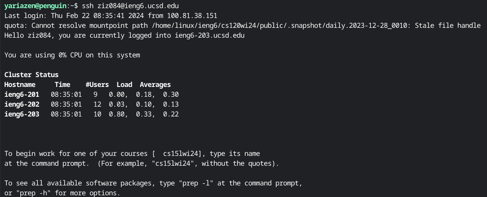
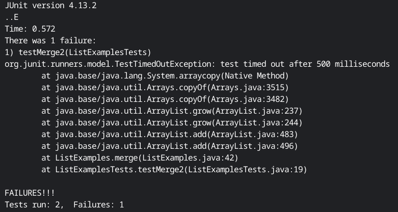
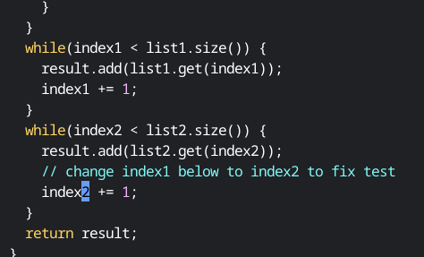
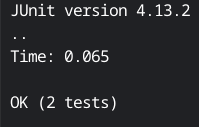

# Lab 4

## Step 4


Logging into ieng6 with my private ssh key. I'll be doing it locally from here on out.

Key pressed: ```ssh ziz084@ieng6.ucsd.edu```

## Step 5


Cloning lab7 repo

Key pressed: ```git clone git@github.com:Yariazen/lab7.git```

```cd lab7```
## Step 6


Running the tests

Key pressed: ```bash test.sh```

## Step 7


Key pressed:```vim ListExamples.java``` 

```44G``` 

```e``` 

```r``` 

```2``` 

```:wq```

## Step 8


Key pressed: ```<up><up><enter>```